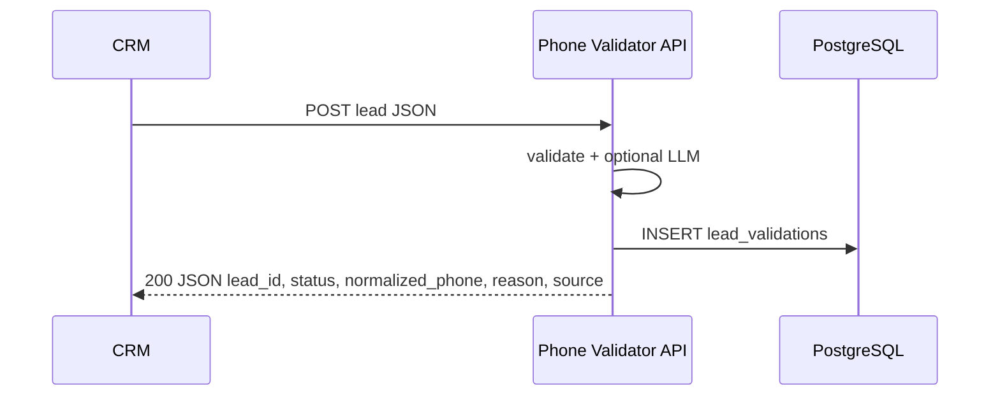

# Phone Validator Service

Сервис принимает лиды из CRM по **webhook**, нормализует телефон в **E.164** (детерминированные правила + при необходимости **OpenAI**), сохраняет результат в **PostgreSQL** и **возвращает JSON в том же HTTP-ответе**. К **SPA-дашборду** подключены метрики, графики и таблица последних обработок.

## Внешние сервисы и регистрация

Нужны **свои аккаунты** у провайдеров ниже — без ключей часть функций работает в урезанном режиме.

| Сервис | Зачем | Что сделать |
|--------|--------|-------------|
| **OpenAI** | LLM-fallback для «починки» номера | [platform.openai.com](https://platform.openai.com/) — API key в **`OPENAI_API_KEY`** |
| **IPinfo** | Страна по IP для 10-значных локальных номеров | **Регистрация обязательна:** [ipinfo.io/signup](https://ipinfo.io/signup) (бесплатный план **Lite**), токен из кабинета → **`IPINFO_TOKEN`**. Без токена геолокация по IP отключается, подставляется только **`IP_GEO_DEFAULT_COUNTRY`**. |

---

## Содержание

- [Внешние сервисы и регистрация](#внешние-сервисы-и-регистрация)
- [Стек и структура](#стек-и-структура)
- [Быстрый старт](#быстрый-старт)
- [CRM Webhook](#crm-webhook)
- [API: метрики и дашборд](#api-метрики-и-дашборд)
- [Стратегия валидации](#стратегия-валидации)
- [Локальная разработка](#локальная-разработка)
- [Тесты](#тесты)
- [Миграции БД](#миграции-бд)
- [`mock.json`](#mockjson)
- [Безопасность](#безопасность)

---

## Стек и структура

| Слой | Технологии |
|------|------------|
| Backend | FastAPI, SQLAlchemy async, PostgreSQL, Alembic |
| Frontend | React, TypeScript, Vite |
| Инфра | Docker Compose, Nginx |

**Каталоги**

| Путь | Назначение |
|------|------------|
| `app/` | API, домен, сервисы, репозитории |
| `frontend/` | дашборд метрик |
| `tests/` | pytest (unit + integration) |
| `migrations/` | ревизии Alembic |
| `docker-compose.yml` | postgres, backend, frontend, nginx |

---

## Быстрый старт

1. Скопируйте окружение: `copy .env.example .env` (Windows) или `cp .env.example .env`.
2. В `.env` задайте **`OPENAI_API_KEY`** (нужен аккаунт OpenAI).
3. Для реальной геолокации по IP: **зарегистрируйтесь на [IPinfo](https://ipinfo.io/signup)**, возьмите токен в дашборде и пропишите **`IPINFO_TOKEN`** ([документация Lite API](https://ipinfo.io/developers/lite-api)). Иначе IP не резолвится в страну — только дефолт **`IP_GEO_DEFAULT_COUNTRY`**.
4. Запуск: `docker-compose up --build`
5. Открыть UI: **http://localhost:8005** · health: **http://localhost:8005/health**

Nginx: `/` → frontend, `/api/*` → backend:8000. Порт Postgres наружу не пробрасывается.

---

## CRM Webhook

**Эндпоинт:** `POST /api/v1/webhooks/crm/lead`

| Окружение | URL |
|-----------|-----|
| Через Compose + Nginx | `http://localhost:8005/api/v1/webhooks/crm/lead` |
| Прямо в backend | `http://localhost:8000/api/v1/webhooks/crm/lead` |

Тело: **JSON**, заголовок `Content-Type: application/json`.



**Опциональная защита:** если в `.env` задан **`WEBHOOK_TOKEN`**, клиент обязан передать заголовок `X-Webhook-Token` с тем же значением. Пустой токен — проверка отключена (удобно локально).

### IP для геоконтекста

Для **10 цифр без кода страны** префикс берётся из страны визита. Порядок источников IP:

1. `X-Forwarded-For` (первый адрес)
2. поле **`VISITOR_IP`** в JSON
3. разбор **`COMMENTS`** (например `IP: [b]203.0.113.1[/b]`)

Далее backend дергает [IPinfo Lite](https://ipinfo.io/developers/lite-api) с **`token`** в query — **без регистрации на ipinfo.io и значения `IPINFO_TOKEN` запросы к API не выполняются** (в лог пишется предупреждение, в БД — `default_cc_applied`). Остальные переменные: `IP_GEO_*` (см. `.env.example`).

### Форматы тела

Поддерживаются плоский объект Bitrix и обёртки `FIELDS` / `data` (в т.ч. JSON-строка в `FIELDS`). Обязателен **`ID`**; для телефона используется **`CONTACT_PHONE`**.

**Пример плоского объекта:**

```json
{
  "ID": "190301",
  "TITLE": "New deal from James Carter",
  "CONTACT_PHONE": "(714) 883-9188",
  "COMMENTS": "utm…",
  "DATE_CREATE": "2026-01-05T10:12:00+03:00"
}
```

Обёртка Bitrix: объект `FIELDS` или вложенность `data.FIELDS` (в т.ч. строка JSON). Неизвестные ключи верхнего уровня плоского объекта **игнорируются**.

**Поля (имена как в CRM)**

| JSON-ключ | Назначение | Обязательность |
|-----------|------------|----------------|
| `ID` | Идентификатор лида | **Да** (в JSON может быть число, внутри станет строкой) |
| `CONTACT_PHONE` | Сырой телефон | Нет; пустая строка = нет номера |
| `VISITOR_IP` | Явный IP клиента | Нет; иначе `X-Forwarded-For` или разбор `COMMENTS` |
| Остальное (`TITLE`, `STAGE_ID`, `UTM_*`, `COMMENTS`, `DATE_CREATE`, …) | Совместимость с реальным webhook | Нет |

**Ответ `200 OK`:**

```json
{
  "lead_id": "190301",
  "status": "valid",
  "normalized_phone": "+17148839188",
  "reason": null,
  "source": "deterministic"
}
```

Поля: `status` — `valid` | `invalid`; `normalized_phone` — E.164 при успехе; `reason` — код отказа при `invalid`; `source` — `deterministic` | `llm`.

**Ошибки:** `401` — неверный/отсутствующий webhook-токен; `422` — схема/JSON.

**Важно:** сервис **не вызывает CRM повторно** — Bitrix/outbound-сценарий должен сам прочитать **тело ответа** и обновить поле телефона.

### Примеры вызова

```bash
curl -sS -X POST "http://localhost:8005/api/v1/webhooks/crm/lead" \
  -H "Content-Type: application/json" \
  -d "{\"ID\":\"190301\",\"TITLE\":\"Test\",\"CONTACT_PHONE\":\"(714) 883-9188\"}"
```

```powershell
$body = '{"ID":"190301","TITLE":"Test","CONTACT_PHONE":"(714) 883-9188"}'
Invoke-RestMethod -Uri "http://localhost:8005/api/v1/webhooks/crm/lead" `
  -Method Post -ContentType "application/json" -Body $body
```

### Как проверить вебхук

1. **pytest:** `pip install -e ".[dev]"` → `pytest tests/integration/test_webhook.py tests/unit/test_crm_payload.py -q`
2. **Живой Docker** + `curl` / PowerShell выше.
3. В UI блок **Mock Replay** шлёт лиды из `mock.json` на тот же URL.

---

## API: метрики и дашборд

| Метод | Путь | Описание |
|--------|------|----------|
| GET | `/api/v1/metrics/summary` | Всего / valid / invalid / success_rate, словарь причин |
| GET | `/api/v1/metrics/timeseries?days=7` | Динамика valid/invalid по дням |
| GET | `/api/v1/metrics/recent` | Последние записи (см. query ниже) |
| GET | `/api/v1/metrics/advanced` | LLM share, top reasons, source split |
| GET | `/api/v1/metrics/chart/mismatch-by-cc` | Mismatch по `assumed_dial_cc` (`days`, `limit`) |
| GET | `/api/v1/metrics/chart/llm-timeseries?days=7` | Доля deterministic vs LLM по дням |
| GET | `/api/v1/metrics/chart/invalid-reasons` | Распределение причин только для `invalid` (`days`) |
| DELETE | `/api/v1/metrics/recent/{id}` | Удалить запись |
| DELETE | `/api/v1/metrics/recent` | Удалить все |
| GET | `/api/v1/dev/mock-leads` | Лиды из `mock.json` + `source_path` (путь не настраивается через env) |

**`GET /api/v1/metrics/recent` — query-параметры**

| Параметр | Описание |
|----------|----------|
| `limit` | 1…500, по умолчанию 20 |
| `geo_mismatch_only=true` | Только строки с несовпадением гео и CC номера |
| `confidence` | `deterministic` или `llm` |
| `status` | `valid` или `invalid` |

Период **`days`** в графиках совпадает с выбором «Last N days» в шапке дашборда.

---

## Стратегия валидации

1. **Детерминированно** (`DeterministicPhoneValidator`): пустые/короткие/длинные строки, нецифры, повтор одной цифры; лишняя ведущая `1` перед чужим CC (`+1393…` → `+393…`); 10 цифр без `+` — CC из гео (NANP для US/CA и т.д.); RU «8…» → `+7…`; известные CC; последовательности `0123456789` / `9876543210` не получают авто-CC (LLM или отказ).
2. **LLM** (`gpt-4o-mini`): только если результат recoverable; JSON + retry; повторная проверка E.164.
3. **Post-LLM NANP `+1`**: только при геоконтексте US/CA (или дефолт из `.env`), не для «лестничных» 10 цифр.

В таблице дашборда: страна по IP, предполагаемый CC, mismatch, confidence, флаг дефолтного CC.

---

## Локальная разработка

**Backend**

```bash
pip install -e ".[dev]"
alembic upgrade head
uvicorn app.main:app --reload
```

**Frontend**

```bash
cd frontend
npm install
npm run dev
```

---

## Тесты

```bash
pytest
```

Точечно: `pytest tests/integration/test_webhook.py tests/unit/test_crm_payload.py tests/unit/test_deterministic_validator.py tests/unit/test_pipeline.py`

---

## Миграции БД

- Ревизии: `migrations/versions/`
- В Docker backend перед стартом выполняет `alembic upgrade head` (retry: `DB_WAIT_MAX_ATTEMPTS`, `DB_WAIT_SLEEP_SECONDS` в `.env`).
- Локально: `alembic upgrade head` · `alembic downgrade -1` · `alembic revision -m "msg"`

**Внешняя PostgreSQL:** задайте `DATABASE_URL` в `.env`; контейнер `postgres` в compose можно не использовать.

---

## `mock.json`

**Где лежит:** файл в **корне репозитория** рядом с каталогом `app/`. В Docker тот же файл монтируется в **`/app/mock.json`** (read-only в `docker-compose.yml`). Путь через `.env` **не** задаётся: backend ищет `mock.json` сначала от корня проекта (как при локальном запуске), затем fallback **`/app/mock.json`**.

**Корень JSON** (парсит `extract_leads_from_mock_json_root` в `app/utils/crm_payload.py`):

| Корень файла | Содержимое |
|--------------|------------|
| Массив `[{...}, ...]` | Список лидов (**так сейчас в репозитории** — объекты с полями Bitrix: `ID`, `CONTACT_PHONE`, `COMMENTS`, `UTM_*`, …) |
| `{"items": [...]}` / `{"leads": [...]}` / `{"records": [...]}` | Массив лидов внутри ключа |
| `{"data": [...]}` | Массив лидов в `data` |
| `{"data": {"FIELDS": {...}}}` | Один лид (объект полей как в webhook) |

В **`COMMENTS`** в примерах из репозитория часто есть строка **`IP: [b]…[/b]`** — её использует webhook для извлечения IP, если нет `VISITOR_IP` и `X-Forwarded-For`.

---

## Безопасность

- Секреты и конфиг только через **env** (шаблон — `.env.example`).
- Вход/выход вебхука — **Pydantic**.
- Слои: API → services → repositories → domain.
